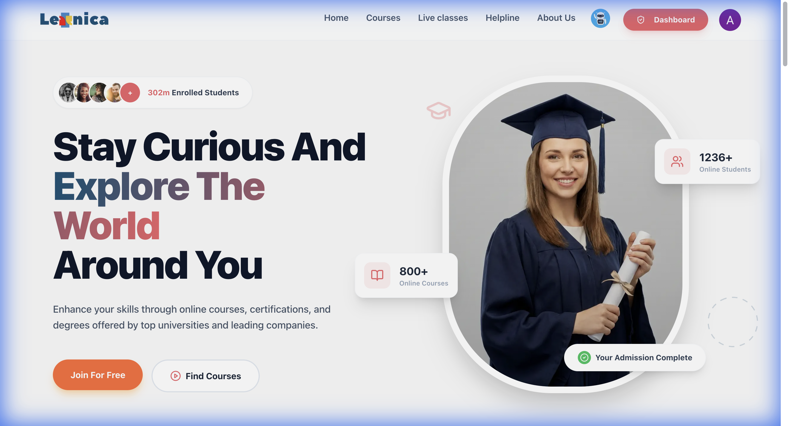
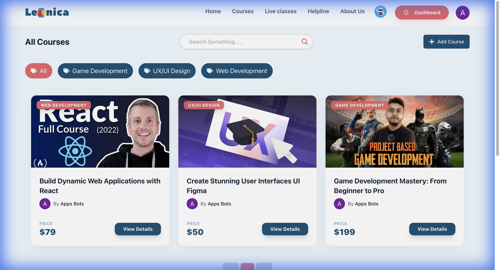
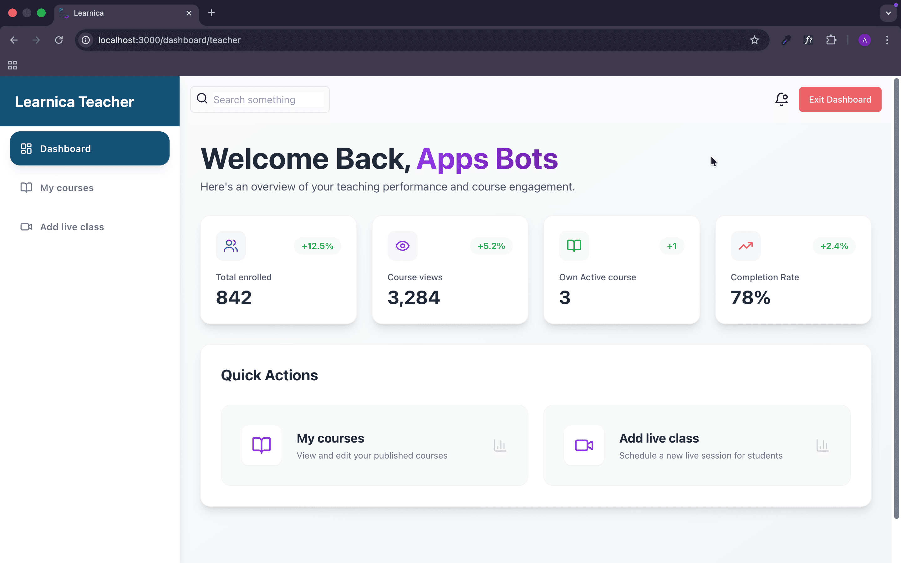
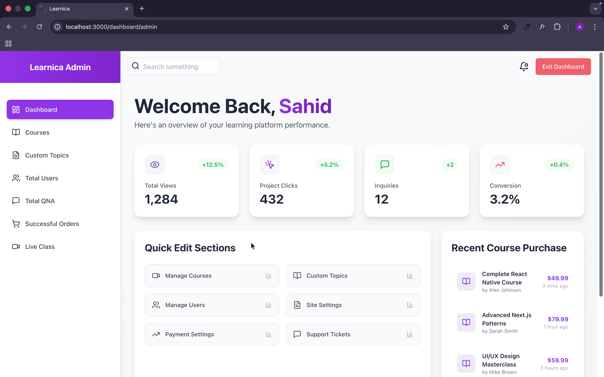

# <p align="center"><br>Learnica 2.0</p>

<p align="center">
  <strong>The Ultimate Next-Generation Learning Management System</strong>
</p>

<p align="center">
  
  
  
  
  
  
</p>

---

## 🌟 Overview

**Learnica 2.0** is a premium, feature-rich Online Course Management System built with the modern web stack. It offers an unparalleled learning experience with a focus on high-performance, beautiful UI/UX, and comprehensive tools for students, instructors, and administrators. 

Whether you're looking to master a new skill or share your knowledge with the world, Learnica 2.0 provides the perfect platform to empower your journey.

### 🔗 [Live Preview](https://learnica-2-0.vercel.app)

---

## ✨ Features Spotlight

### 🎓 Student Experience
- **Interactive Course Player:** A seamless interface for watching lessons, tracking progress, and managing course materials.
- **Engagement Tools:** Integrated **Q&A**, **Personal Notes**, **Reviews**, and **Downloadable Resources** for every course.
- **Progress Tracking:** Real-time tracking of completed lessons and overall course progress.
- **AI-Powered Learning:** Built-in AI assistant to help students with their queries instantly.
- **Custom Collections:** Ability to build personalized course libraries.

### 👨‍🏫 Instructor Dashboard
- **Comprehensive Analytics:** Track total enrollment, course views, and completion rates with beautiful data visualizations.
- **Course Management:** Effortlessly create, edit, and manage courses and lessons.
- **Live Sessions:** Schedule and conduct real-time live classes to interact with students directly.
- **Quick Actions:** Streamlined workflow for adding new content and updating existing courses.

### 🛡️ Administrative Control
- **Centralized Management:** Oversee all platform activities from a powerful admin dashboard.
- **Role Management:** Full control over Admin, Instructor, and Student roles.
- **Financial Oversight:** Detailed tracking of successful orders and payment history.
- **Moderation Tools:** Approve or reject course submissions to ensure high-quality content across the platform.

---

## 📸 Visual Tour

### 🏠 Stunning Homepage

*A modern, welcoming landing page designed to inspire learners.*

### 📚 Course Discovery

*Beautifully categorized courses with advanced search and filtering.*

### 🎥 Premium Playing Interface

*Distraction-free learning environment with all the tools you need in one place.*

### 📊 Instructor Dashboard

*Deep insights into teaching performance and student engagement.*

### 🛡️ Admin Command Center

*Powerful tools for total platform management and data monitoring.*

---

## 🛠️ Technology Stack

| Layer | Technologies |
| :--- | :--- |
| **Frontend** | Next.js 14, React 18, Framer Motion, Tailwind CSS, Lucide Icons |
| **UI Components** | Shadcn/UI, Daisy UI |
| **Backend** | Node.js, Express.js |
| **Database** | MongoDB & Mongoose |
| **Authentication** | Clerk |
| **Real-time** | Socket.io |
| **Payments** | Stripe Gateway |
| **Media** | Cloudinary |

---

## 🚀 Getting Started

### Prerequisites
- Node.js (v18.x or later)
- npm or yarn

### Installation

1. **Clone the repository:**
   ```bash
   git clone https://github.com/sahidDev09/Learnica-2.0.git
   cd Learnica-2.0
   ```

2. **Install dependencies:**
   ```bash
   npm install
   ```

3. **Set up environment variables:**
   Create a `.env.local` file in the root directory and add your credentials:
   - Clerk API Keys
   - MongoDB URI
   - Stripe Secret Key
   - Cloudinary Credentials

4. **Run the development server:**
   ```bash
   npm run dev
   ```

5. **Access the application:**
   Open [http://localhost:3000](http://localhost:3000) in your browser.

---

## 👥 Meet the Team

| Name | Role |
| :--- | :--- |
| **Sahid** | MERN Stack Developer & UI/UX Designer |
| **Farha** | Frontend Developer |
| **Rahat Faruk** | Full Stack Developer |
| **Abdul Mazed** | Full Stack Developer |
| **[Numan Ahmod](https://www.linkedin.com/in/numan-ahmod/)** | MERN Stack Developer |

---

## 📄 Documentation

For detailed information on architecture, API endpoints, and system design, please refer to the [Detailed Documentation](https://docs.google.com/document/d/1z-jP5jOvPV1-gmGWIApbxTUz4zkCE_-YS27OcJH_0vY/edit?usp=sharing).

---

<p align="center">Build with passion by the <strong>Learnica Team</strong> ❤️</p>
<p align="center">
  <a href="https://learnica-2-0.vercel.app">Official Website</a> •
  <a href="https://github.com/sahidDev09/Learnica-2.0">Repository</a>
</p>
